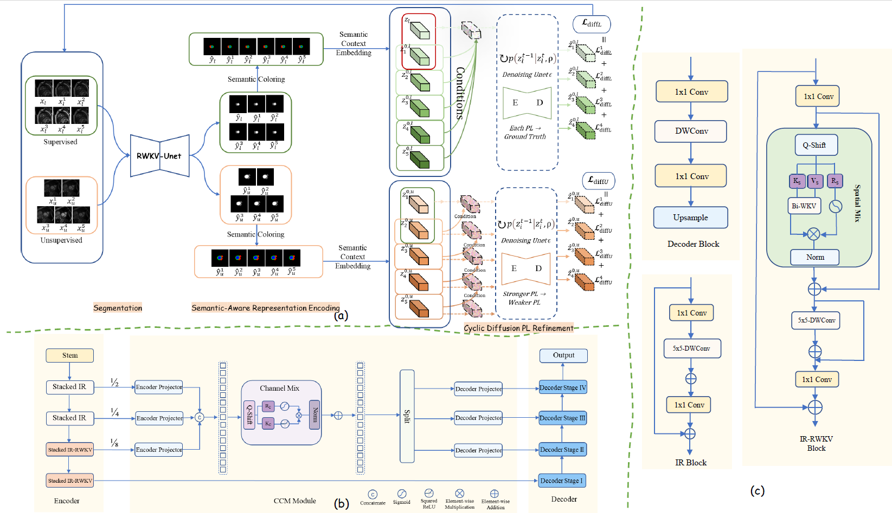

# CURE 🧑‍⚕️
## Cyclic Uncertainty REctification in Diffusion-Based Semi-Supervised Medical Image Segmentation

This repository contains the official implementation of CURE, a diffusion-guided semi-supervised medical image segmentation framework based on cyclic pseudo-label refinement under progressive perturbation transitions.

📌 Note: The full source code and pretrained weights will be released upon the acceptance/publication of the paper.

---

## Framework Overview

Figure 1 shows the overall architecture of CURE.

  

Overall architecture of CURE. (a) The proposed framework combines semi-supervised segmentation with diffusion-guided pseudo-label refinement over augmented labeled and unlabeled image sequences. (b) The segmentation network adopts RWKV-UNet [1], which contains IR and IR-RWKV encoder blocks, a cross-channel mixing module, and a lightweight decoder. (c) The key backbone components include the IR block for local feature extraction, the IR-RWKV block for RWKV-based sequential modeling, and the decoder block for spatial resolution recovery.

---

## Detailed Framework Description

The proposed framework integrates a semi-supervised segmentation network with a diffusion-guided pseudo-label refinement pipeline. As shown in Fig. 1(a), the framework first takes a sequence of augmented labeled and unlabeled images as input. The segmentation network then generates multi-level predictions, which are transformed by semantic coloring and embedded into a latent space. The latent diffusion module progressively refines pseudo-labels. For labeled samples, the refinement is optimized by aligning pseudo-labels with the ground truth. For unlabeled samples, the refinement is guided by consistency constraints across different augmentation levels. All components are jointly trained in an end-to-end manner under limited supervision.

Figure 1(b) presents the detailed structure of the segmentation network adopted in CURE. We use the RWKV-UNet architecture proposed by Jiang et al. [1], which consists of a stacked encoder with IR and IR-RWKV blocks, a cross-channel mixing module (CCM), and a lightweight decoder based on pointwise and depthwise convolutions. This structure provides strong spatial-temporal representation capacity and complements the proposed diffusion-guided cyclic pseudo-label refinement framework.

Figure 1(c) shows the key components of the segmentation backbone. The Inverted Residual (IR) block serves as the basic unit for local feature extraction. The Inverted Residual RWKV (IR-RWKV) block integrates RWKV-based sequential modeling into the residual path. The decoder block consists of a pointwise convolution layer, a $9 \times 9$ depthwise separable convolution layer, another pointwise operation layer, and an upsampling layer for spatial resolution recovery.

---

## References

[1] Jiang, J., Zhang, J., Liu, W., Gao, M., Hu, X., Yan, X., Huang, F., Liu, Y.  
"RWKV-UNet: Improving UNet with Long-Range Cooperation for Effective Medical Image Segmentation."  
arXiv preprint arXiv:2501.08458, 2025.

---

## Citation

If you find this work useful, please consider citing our paper.  
BibTeX information will be provided upon publication.

---

## Contact

For questions or collaborations, please open an issue or contact us.
