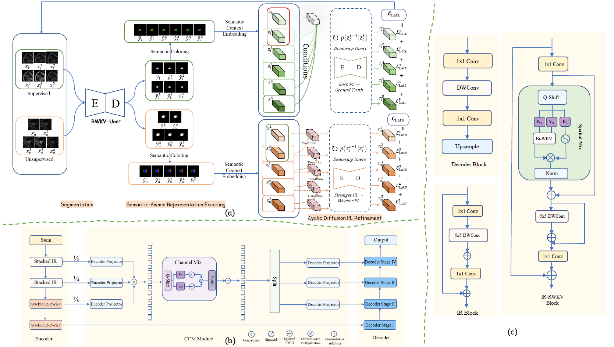

# CURE 🧑‍⚕️
## CURE: Conditional Uncertainty Refinement for Semi-Supervised Medical Image Segmentation

This repository contains the official implementation of CURE, a diffusion-guided semi-supervised medical image segmentation framework with pairwise pseudo-label refinement under progressive perturbations.

📌 Note: The full source code and pretrained weights will be released upon the acceptance/publication of the paper.

---

## Framework Overview

Figure 1 shows the overall architecture of CURE.

  

Overall architecture of CURE. (a) The proposed framework combines semi-supervised segmentation with diffusion-guided pseudo-label refinement over augmented labeled and unlabeled image sequences. (b) The segmentation network adopts RWKV-UNet [1], which contains IR and IR-RWKV encoder blocks, a cross-channel mixing module, and a lightweight decoder. (c) The key backbone components include the IR block for local feature extraction, the IR-RWKV block for RWKV-based sequential modeling, and the decoder block for spatial resolution recovery.

## References

[1] Jiang, J., Zhang, J., Liu, W., Gao, M., Hu, X., Yan, X., Huang, F., Liu, Y.  
"RWKV-UNet: Improving UNet with Long-Range Cooperation for Effective Medical Image Segmentation."  
arXiv preprint arXiv:2501.08458, 2025.

---

## Citation

If you find this work useful, please consider citing our paper.  
BibTeX information will be provided upon publication.

---

## Contact

For questions or collaborations, please open an issue or contact us.
